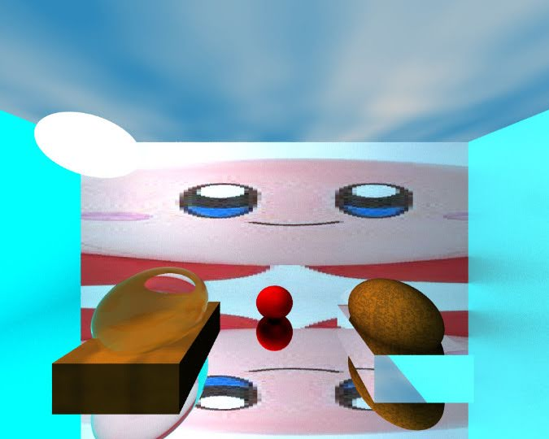

# CPU Path Tracer

A physically inspired **path tracer** written from scratch in C++20 that renders scenes on the CPU and writes the result as a PPM image.

This project was built during EPITA's IMAGE major. The goal was to implement a path tracer in C++ after learning how the algorithm works.



*The default scene, which uses every feature implemented. It takes about 20 minutes to render on our machines.*

## Contributors

- [alexis.meunier](https://github.com/Alexis-Meunier)
- [roman.miralves](https://github.com/Rorolol-creator)

## Features

**Geometry**
- Spheres
- Triangles
- Complex meshes loaded from `.obj` files
- Blobs (implicit surfaces)
- BVH (bounding volume hierarchy) acceleration structure for mesh rendering

**Materials and textures**
- Glass
- Image textures
- Uniform textures
- Procedural textures (sky and wood, based on 3D Perlin noise)

**Lights**
- Point light
- Circle light (spot)

## Requirements

- A C++20 compiler (`g++` recommended)
- `make`

No external libraries are needed.

## Building

From the project root:

```sh
make
```

To remove build artifacts:

```sh
make clean
```

## Running

```sh
./main <output_path>
```

| Argument      | Description                                  |
| ------------- | -------------------------------------------- |
| `output_path` | Path of the image file the render is saved to |

The result is saved in the **PPM** format. Most image viewers (GIMP, IrfanView, feh, ...) can open it, or you can convert it, for example with ImageMagick:

```sh
convert render.ppm render.png
```

### Example

```sh
./main render.ppm
```

## Creating your own scene

Scenes are defined in code. Open `src/moteur.cc` and edit the `main` function: create objects from the different classes (spheres, triangles, meshes, lights, ...), assign them textures, and set their positions. Then rebuild with `make` and run again.

We know this is tedious. A scene description file may come later (or not).

By default, `main` loads the demo scene shown above.

## Performance

Rendering is CPU-only and gets slow with complex scenes and high sample counts. The default scene takes around 20 minutes. The build uses `-O3 -march=native`, so binaries are tuned for the machine that compiled them and should not be copied to a different CPU.